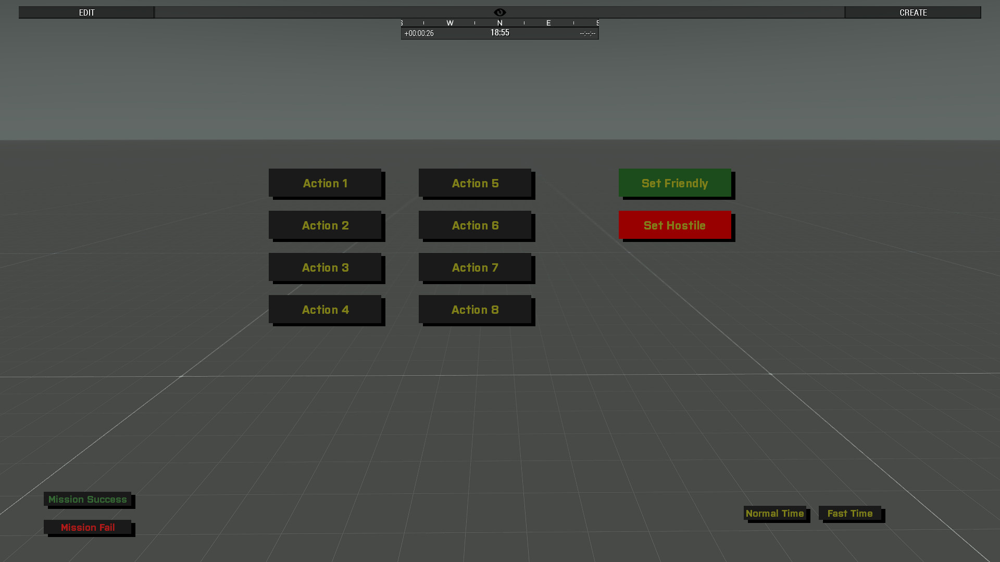

# Zeus Mission Control (ZMC)

A mission console for Zeus game masters in Arma 3. Opens with **Ctrl+Shift+Z** (Y on QWERTY keyboards) — only for players with an assigned Zeus unit. No dependencies, no script code required in the mission.



## Features

Standard buttons (always available, affect all players):

- **Set Friendly / Set Hostile** — set Independent friendly/hostile towards BLUFOR
- **Fast Time / Normal Time** — toggle x60 time acceleration
- **Mission Success / Mission Fail** — end the mission for everyone

Plus up to **8 freely assignable action buttons**, defined by the mission maker in `description.ext`.

## Defining actions

Create a `MissionControl` class in the mission's `description.ext`. Only defined actions are shown, the rest are hidden:

```cpp
class MissionControl
{
    class Action1
    {
        text = "Call reinforcements";
        code = "[] execVM 'scripts\reinforcements.sqf';";
    };
    class Action2
    {
        text = "Blow the bridge";
        code = "[bridge_1, 1] remoteExec ['setDamage', 2];";
    };
    // Action3 .. Action8 as needed
};
```

- `code` runs **locally on the Zeus machine**. For global effects, use `remoteExec` in the code (target `2` = server, `0` = everyone).
- Inside `code` strings, use single quotes `'…'` or doubled double quotes `""…""`.

## License

Licensed under the MIT License. Credit appreciated.

## Support

If you enjoy Zeus Mission Control and want to say thanks: [Buy me a coffee](https://buymeacoffee.com/claudehohl)
